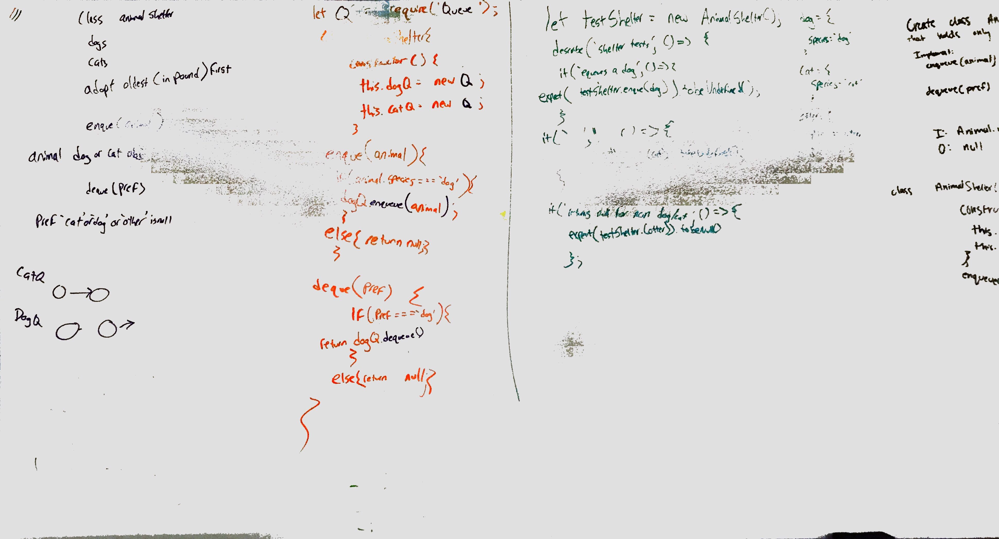

# Challenge Summary
Code Challenge 12 - worked directly with Lee King.

Creating class Animal Shelter

## Challenge Description
Create a class called AnimalShelter which holds only dogs and cats. The shelter operates using a first-in, first-out approach.

## Approach & Efficiency
First-in, First out Animal Shelter.

## Solution

