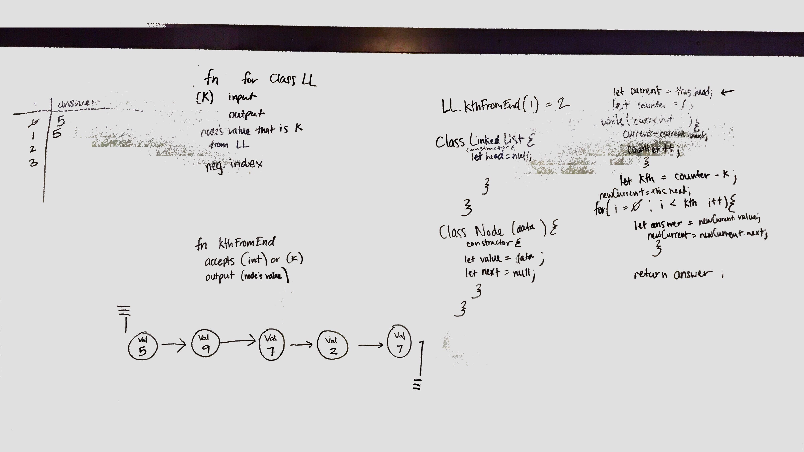

# Challenge Summary
Code Challenge 6

Working with appending and insterting to linkedlists.

## Challenge Description
.append(value) which adds a new node with the given value to the end of the list.
.insertBefore(value, newVal) which add a new node with the given newValue immediately before the first value node.
.insertAfter(value, newVal) which add a new node with the given newValue immediately after the first value node.

## Approach & Efficiency
approach linkedlists by figuring out what they are and hwo to communicate with them.

## Solution

# Challenge Summary
Code Challenge 7

Working through a linked list, finding a specific value.

## Challenge Description
Add method .kthFromTheEnd that accepts a paramter named k, k needs to give the node's value from the (-)index of the entire linked list.

## Approach & Efficiency
Approach is to indentify where k is from the beginning of the Linked List and then for loop through the linked list the correct number of times.

## Solution

