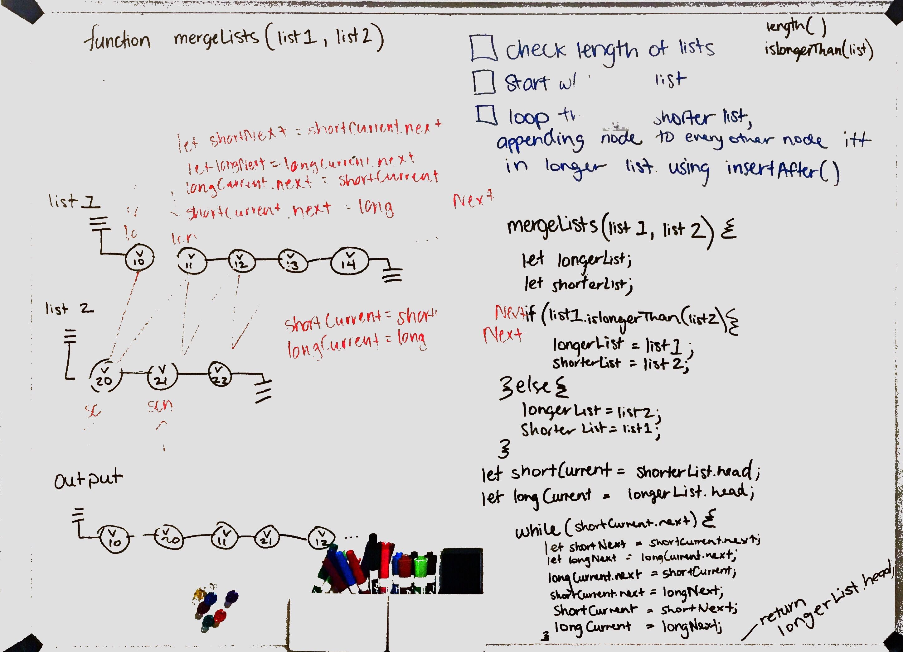
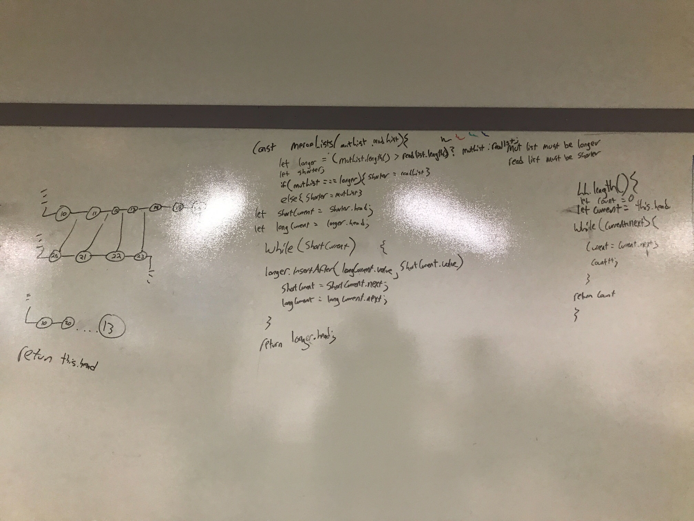
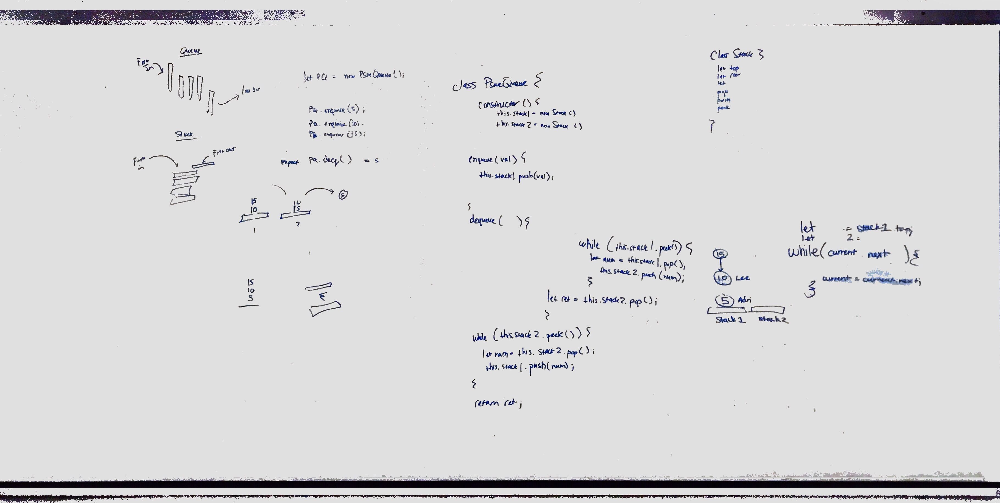

# Challenge Summary
Code Challenge 6

Working with appending and insterting to linkedlists.

## Challenge Description
.append(value) which adds a new node with the given value to the end of the list.
.insertBefore(value, newVal) which add a new node with the given newValue immediately before the first value node.
.insertAfter(value, newVal) which add a new node with the given newValue immediately after the first value node.

## Approach & Efficiency
approach linkedlists by figuring out what they are and hwo to communicate with them.

## Solution

# Challenge Summary
Code Challenge 7 - worked directly with Lee King.

Working through a linked list, finding a specific value.

## Challenge Description
Add method .kthFromTheEnd that accepts a paramter named k, k needs to give the node's value from the (-)index of the entire linked list.

## Approach & Efficiency
Approach is to indentify where k is from the beginning of the Linked List and then for loop through the linked list the correct number of times.

## Solution

# Challenge Summary
Code Challenge 8 - worked directly with Lee King.

Merging two linked lists into one of the inputed lists.

## Challenge Description
Add a global function outside of the LinkedList class that accepts two linked lists as parameters. Returns one of the two parameters with zipped nodes.

## Approach & Efficiency
Approach was to chain the .next values of each list and point to the other list's node;

## Solution

# Stacks and Queues
Implement a Stack and a Queue Data Structure

## Challenge
Created a Node class that has properties for the value stored in the Node, and a pointer to the next node.
Created a Stack class that has a top property. It creates an empty Stack when instantiated.
Create a Queue class that has a front property. It creates an empty Queue when instantiated.

## Approach & Efficiency
My approach is always efficiency, but the point of linked lists is to preserve space. So often I opt for that.

## API
Method called push which takes any value as an argument and adds a new node with that value to the top of the stack with an O(1) Time performance.
Method called pop that does not take any argument, removes the node from the top of the stack, and returns the node’s value.
Method called peek that does not take an argument and returns the value of the node located on top of the stack, without removing it from the stack.

Method called enqueue which takes any value as an argument and adds a new node with that value to the back of the queue with an O(1) Time performance.
Method called dequeue that does not take any argument, removes the node from the front of the queue, and returns the node’s value.
Method called peek that does not take an argument and returns the value of the node located in the front of the queue, without removing it from the queue.

# Challenge Summary
Code Challenge 11 - worked directly with Lee King and Brad Smialek.

Creating class PsuedoQueue that has two methods that enqueue and dequeue off of two separate stacks. I later changed this to try to apply the Single Responsibility Principle.

## Challenge Description
We wanted to save space over fast execution.

## Approach & Efficiency
Approach was to think of these as pallets and we are putting heavy inventory one at a time and need to keep things in a specific order but always pull from the first item placed.

## Solution

